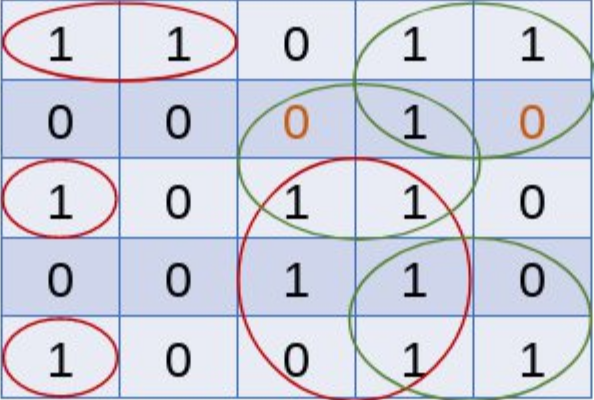

# Trabalho 01 - Jogo da Vida

## Disciplina: Algoritmo e Estrutura de Dados / CEFET-MG (Campus V)

### Jogo Da Vida

O Jogo da Vida é um autômato celular, representado por uma matriz 2D de células, cada uma
podendo estar viva (1) ou morta (2). Seguindo as seguintes regras:

  - Uma célula viva com menos de dois vizinhos vivos morre; 
  - Uma célula viva com mais de três vizinhos vivos morre;
  - Uma célula viva com dois ou três vizinhos vivos sobrevive;
  - Uma célula morta com exatamente três vizinhos vivos se torna viva (reprodução).

 

### Desenvolvimento e Execução

Desenvolvi meu projeto na linguagem C++ e considerei apenas matrizes quadradas, lidas dentro do
arquivo 'src/input.mps'. Após a leitura, é solicitado ao usuário a quantidade de gerações que deseja 
realizar. O programa irá rodar até que satisfaça a quantidade de gerações ou até que a matriz atual
seje equivalente a anterior. A execução é armazenada em um arquivo 'src/output.mps', contendo a matriz
gerada e a quantidade de vivos e mortos.

No terminal é possível verificar o processo com a função void 'estado_JDV', que imprime o estado do jogo naquele momento
e informa ao usuário quando o jogo é encerrado devido a equivalência de matrizes mencionada anteriormente.

Durante o processo de desenvolvimento do trabalho, não tive dificuldade na lógica do jogo. Porém tentei realizar algumas
aplicações da linguagem inválidas (preciso intensificar meus estudos em C++). Ao final aprendi um comando que eu não conhecia:

| Comando                |  Função                                                                                           |                     
| -----------------------| ------------------------------------------------------------------------------------------------- |
|  `for (auto var : array)` | um laço que pega cada dado de um conjunto, o auto é para indentificar automaticamente o dado |
